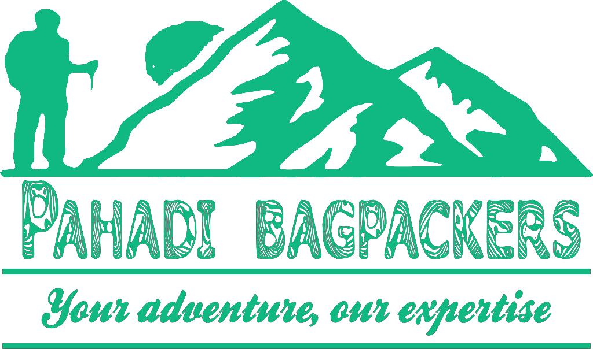

# Pahadi Bagpackers 🏔️🎒

A complete, professional, modern **16-Page Next.js (App Router, TypeScript, Tailwind CSS, Lucide Icons)** travel, trekking, and adventure website for **Pahadi Bagpackers**, specializing in Himachal Pradesh and Uttarakhand.



---

## 🌟 Key Features & Pages

- **True Multi-Page Architecture**: 16 dedicated Next.js App Router pages:
  - **Home (`/`)**: High-impact Himalayan hero, search planner bar, Himachal & Uttarakhand major destination blocks, featured treks, road trips & reviews.
  - **Destinations Directory (`/destinations`)**: Filterable destination explorer.
  - **Destination Detail (`/destinations/manali`)**: Deep-dive template for Manali Valley.
  - **Treks & Trails (`/treks`)**: Alpine trek catalog filtered by region & difficulty.
  - **Trek Detail (`/treks/hampta-pass`)**: Detailed template for Hampta Pass Trek with day-by-day vertical timeline.
  - **Taxi & Transfers (`/taxi`)**: Outstation taxi fleet & **Interactive Taxi Fare Estimator**.
  - **Car Rental (`/car-rental`)**: Mountain-ready self-drive 4x4 SUV catalog.
  - **Car Detail (`/car-rental/thar-4x4`)**: Mahindra Thar 4x4 detail view.
  - **Bike Rental (`/bike-rental`)**: Himalayan motorcycle fleet (RE Himalayan 450, Scram, BMW GS 310).
  - **Bike Detail (`/bike-rental/himalayan-450`)**: Royal Enfield Himalayan 450 detail view.
  - **Itinerary Planner (`/itinerary-planner`)**: **7-Step Interactive Trip Builder** & instant custom day-by-day generator.
  - **About Us (`/about`)**: Story, Pahadi team, and local basecamps.
  - **Contact (`/contact`)**: Enquiry form, direct WhatsApp/Call shortcuts, basecamp addresses.
  - **FAQ (`/faq`)**: Category-filtered accordion FAQ.
  - **Booking / Enquiry (`/booking`)**: Checkout reservation wizard & confirmation state (#PB-2026-8942).
  - **Travel Stories / Blog (`/blog`) & Article Detail (`/blog/spiti-road-trip-checklist`)**: Himalayan travel guides.

- **Global Navigation & Brand System**:
  - Sticky glassmorphic navbar with Mega Menu dropdowns.
  - Mobile slide-out drawer menu.
  - Official formatted Pahadi Bagpackers logo (`logo-dark-mode.png`).
  - Cross-browser date picker calendar icon visibility fix.

---

## 🚀 Getting Started

### 1. Installation

```bash
npm install
```

### 2. Development Server

```bash
npm run dev
```

Open [http://localhost:3000](http://localhost:3000) with your browser to see the live site.

### 3. Production Build

```bash
npm run build
npm run start
```

---

## 🛠️ Built With

- **Framework**: Next.js 14 (App Router)
- **Language**: TypeScript (`.tsx`)
- **Styling**: Tailwind CSS
- **Icons**: Lucide Icons (`lucide-react`)
- **Fonts**: Google Fonts (`Outfit` + `Plus Jakarta Sans`)
